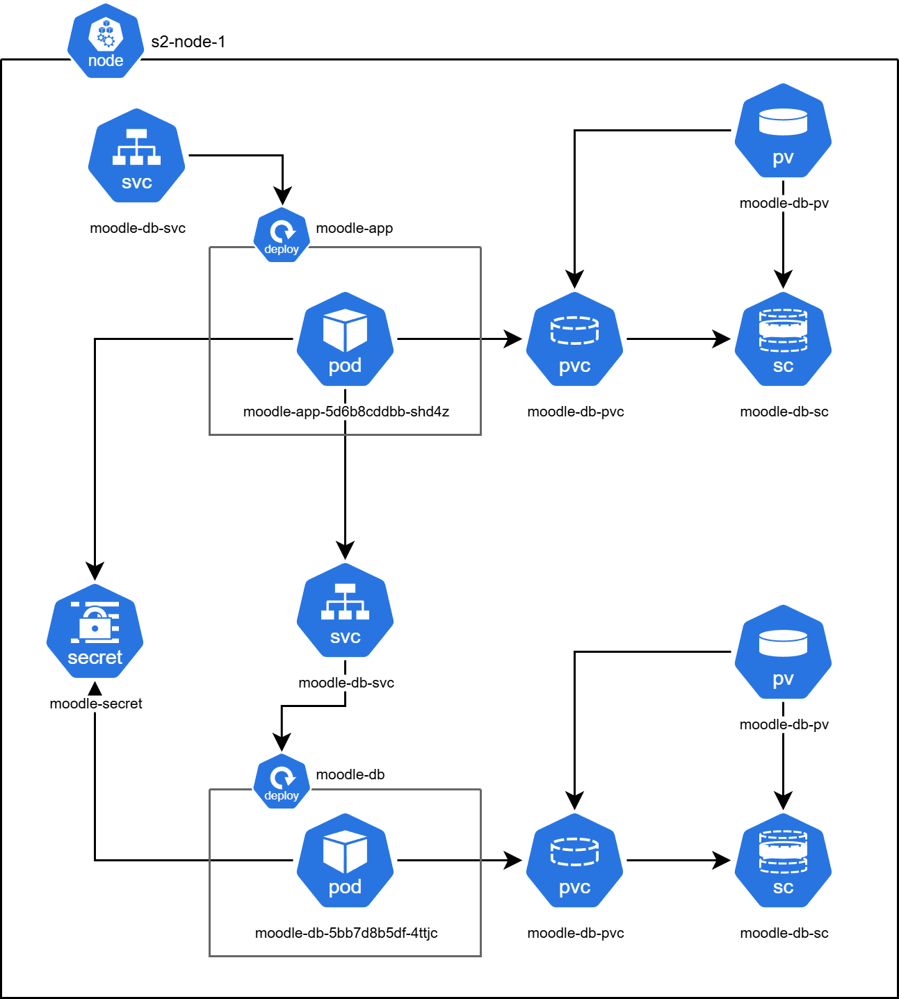

---




```YAML
apiVersion: storage.k8s.io/v1
kind: StorageClass
metadata:
  name: moodle-db-sc
provisioner: kubernetes.io/no-provisioner
volumeBindingMode: WaitForFirstConsumer
```
```YAML
apiVersion: v1
kind: PersistentVolume
metadata:
  name: moodle-db-pv
  labels:
    app: moodle-db
spec:
  accessModes:
  - ReadWriteOnce
  capacity:
    storage: 500Mi
  local:
    path: /pods/moodle/db
  nodeAffinity:
    required:
      nodeSelectorTerms:
      - matchExpressions:
        - key: kubernetes.io/hostname
          operator: In
          values:
          - s2-node-1
  persistentVolumeReclaimPolicy: Retain
  storageClassName: moodle-db-sc
```
```YAML
apiVersion: v1
kind: PersistentVolumeClaim
metadata:
  name: moodle-db-pvc
spec:
  storageClassName: moodle-db-sc
  accessModes:
    - ReadWriteOnce
  resources:
    requests:
      storage: 500Mi
  selector:
    matchLabels:
      use: moodle-db
  volumeName: "moodle-db-pv"
```
```YAML
apiVersion: v1
kind: Service
metadata:
  name: moodle-db-svc
spec:
  selector:
    app: mariadb
  ports:
    - port: 3306
      targetPort: 3306
  clusterIP: None
```
```YAML
apiVersion: apps/v1
kind: Deployment
metadata:
  name: moodle-db-deploy
spec:
  replicas: 1
  selector:
    matchLabels:
      app: mariadb
  template:
    metadata:
      labels:
        app: mariadb
    spec:
      containers:
        - name: mariadb
          image: mariadb:10.11
          env:
            - name: MYSQL_ROOT_PASSWORD
              value: "rootpass"
            - name: MYSQL_DATABASE
              value: "moodle"
            - name: MYSQL_USER
              value: "moodleuser"
            - name: MYSQL_PASSWORD
              value: "moodlepass"
          ports:
            - containerPort: 3306
          volumeMounts:
            - name: data-dir
              mountPath: /var/lib/mysql
      volumes:
        - name: data-dir
          persistentVolumeClaim:
            claimName: moodle-db-pvc
```
```yaml
apiVersion: storage.k8s.io/v1
kind: StorageClass
metadata:
  name: moodle-app-sc
provisioner: kubernetes.io/no-provisioner
volumeBindingMode: WaitForFirstConsumer
```
```yaml
apiVersion: v1
kind: PersistentVolume
metadata:
  name: moodle-app-pv
  labels:
    app: moodle-app
spec:
  accessModes:
  - ReadWriteOnce
  capacity:
    storage: 500Mi
  local:
    path: /pods/moodle/app
  nodeAffinity:
    required:
      nodeSelectorTerms:
      - matchExpressions:
        - key: kubernetes.io/hostname
          operator: In
          values:
          - s2-node-1
  persistentVolumeReclaimPolicy: Retain
  storageClassName: moodle-app-sc
```
```yaml
apiVersion: v1
kind: PersistentVolumeClaim
metadata:
  name: moodle-app-pvc
spec:
  storageClassName: moodle-app-sc
  accessModes:
    - ReadWriteOnce
  resources:
    requests:
      storage: 500Mi
  selector:
    matchLabels:
      use: moodle-app
  volumeName: "moodle-app-pv"
```
```YAML
apiVersion: v1
kind: Service
metadata:
  name: moodle-app-svc
spec:
  selector:
    app: moodle-app
  type: NodePort
  ports:
    - port: 80
      targetPort: 8080
      nodePort: 30080  # Porta exposta no Node
```
```yaml
apiVersion: apps/v1
kind: Deployment
metadata:
  name: moodle-app
spec:
  replicas: 1
  selector:
    matchLabels:
      app: moodle-app
  template:
    metadata:
      labels:
        app: moodle-app
    spec:
      containers:
        - name: moodle
          image: bitnami/moodle:5.0
          env:
            - name: MOODLE_DATABASE_TYPE
              value: "mariadb"
            - name: MOODLE_DATABASE_HOST
              value: "moodle-db-svc"
              # tem que ser nome do Service (sc) do mariadb
            - name: MOODLE_DATABASE_PORT_NUMBER
              value: "3306"
            - name: MOODLE_DATABASE_NAME
              value: "moodle"
            - name: MOODLE_DATABASE_USER
              value: "moodleuser"
            - name: MOODLE_DATABASE_PASSWORD
              value: "moodlepass"
          ports:
            - containerPort: 8080
          volumeMounts:
            - name: data-dir
              mountPath: /bitnami/moodle
      volumes:
        - name: data-dir
          persistentVolumeClaim:
            claimName: moodle-app-pvc
```
