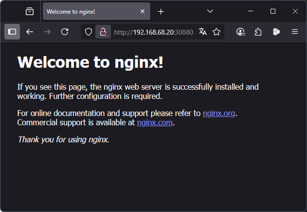

# Módulo 8

- Criar um deployment  e um serviço (Ip cluster) para a app nginx;
- Criar um deployment e um seviçco (NodePort) para a app nginx2;
- Demonstrar as formas de acesso "por fora do cluster" via curl e browser.
---

```console
kubectl run nginx  --image=nginx:alpine
kubectl run nginx2 --image=nginx:alpine
```

```console
kubectl get pods
NAME     READY   STATUS    RESTARTS   AGE
nginx    1/1     Running   0          13m
nginx2   1/1     Running   0          13m
```

`proxy-cluster.yaml`

```yaml
apiVersion: v1
kind: Service
metadata:
  name: proxy-cluster
spec:
  ports:
  - name: proxy-cluster
    port: 8880
    targetPort: 80
    protocol: TCP
  selector:
    run: nginx
  type: ClusterIP
```
```console
kubectl apply -f proxy-cluster.yaml
service/proxy-cluster created
```

```console
kubectl run curl --image=curlimages/curl -- sleep 3600
kubectl exec -it curl -- curl -s http://proxy-cluster:8880 | grep title
<title>Welcome to nginx!</title>
```


`proxy-node.yaml`
```yaml
apiVersion: v1
kind: Service
metadata:
  name: proxy-node
spec:
  ports:
  - name: proxy-node
    nodePort: 30880
    port: 8880
    targetPort: 80
    protocol: TCP
  selector:
    run: nginx2
  type: NodePort

```

```console
kubectl apply -f proxy-node.yaml
service/proxy-node created
```

```console
curl -s http://localhost:30880 | grep title
<title>Welcome to nginx!</title>
```

