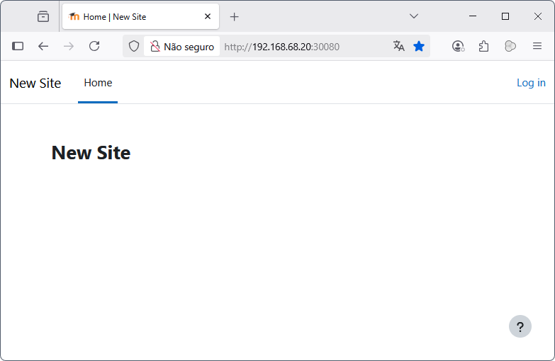

# Módulo 10

- Via Helm fazer o deploy de uma app a escolher;
- Modificar algum parametro de coinfiguração na app (values.yaml);
- Fazer o deploy com as novas configurações.

---
<p align="center">

</p>


`values.yaml`
```yaml
mariadb:
  image: mariadb:10.11
  service:
    type: ClusterIP
    port: '3306'
    targetPort: '3306'
  env:
    MARIADB_ROOT_PASSWORD: rootpass
    MARIADB_DATABASE: moodle
    MARIADB_USER: moodleuser
    MARIADB_PASSWORD: moodlepass
  ports:
    containerPort: '3306'

moodle:
  image: bitnami/moodle:5.0
  service:
    type: NodePort
    port: '8080'
    nodePort: '30080'
  env:
    MOODLE_DATABASE_TYPE: mariadb
    MOODLE_DATABASE_HOST: moodle-db-svc
    MOODLE_DATABASE_PORT_NUMBER: '3306'
    MOODLE_DATABASE_NAME: moodle
    MOODLE_DATABASE_USER: moodleuser
    MOODLE_DATABASE_PASSWORD: moodlepass
  ports: 
    containerPort: '8080'
```
`moodle-db-deploy.yaml`
```yaml
apiVersion: v1
kind: Service
metadata:
  name: moodle-db-svc
spec:
  selector:
    app: moodle-db
  type: {{ .Values.mariadb.service.type }}
  ports:
    - port: {{ .Values.mariadb.service.port }}
      targetPort: {{ .Values.mariadb.service.targetPort }}
  clusterIP: None
---
apiVersion: apps/v1
kind: Deployment
metadata:
  name: moodle-db
spec:
  replicas: 1
  selector:
    matchLabels:
      app: moodle-db
  template:
    metadata:
      labels:
        app: moodle-db
    spec:
      containers:
        - name: mariadb
          image: {{ .Values.mariadb.image }}
          env:
            - name: MARIADB_ROOT_PASSWORD
              value: {{ .Values.mariadb.env.MARIADB_ROOT_PASSWORD }}              
            - name: MARIADB_DATABASE
              value: {{ .Values.mariadb.env.MARIADB_DATABASE }}
            - name: MARIADB_USER
              value: {{ .Values.mariadb.env.MARIADB_USER }}
            - name: MARIADB_PASSWORD
              value: {{ .Values.mariadb.env.MARIADB_PASSWORD }}
          ports:
            - containerPort: {{ .Values.mariadb.ports.containerPort }}
```
`moodle-app-deploy.yaml`
```yaml
apiVersion: v1
kind: Service
metadata:
  name: moodle-app-svc
spec:
  selector:
    app: moodle-app
  type: {{ .Values.moodle.service.type }}
  ports:
    - port: {{ .Values.moodle.service.port }}
      targetPort: {{ .Values.moodle.ports.containerPort }}
      nodePort: {{ .Values.moodle.service.nodePort }}  # Porta exposta no Node
   
---
apiVersion: apps/v1
kind: Deployment
metadata:
  name: moodle-app
spec:
  replicas: 1
  selector:
    matchLabels:
      app: moodle-app
  template:
    metadata:
      labels:
        app: moodle-app
    spec:
      containers:
        - name: moodle
          image: {{ .Values.moodle.image }}
          env:
            - name: MOODLE_DATABASE_TYPE
              value: {{ .Values.moodle.env.MOODLE_DATABASE_TYPE }}            
            - name: MOODLE_DATABASE_HOST
              value: {{ .Values.moodle.env.MOODLE_DATABASE_HOST }}            
            - name: MOODLE_DATABASE_PORT_NUMBER
              value: '3306'
            - name: MOODLE_DATABASE_NAME
              value: {{ .Values.moodle.env.MOODLE_DATABASE_NAME }}                        
            - name: MOODLE_DATABASE_USER
              value: {{ .Values.moodle.env.MOODLE_DATABASE_USER }}              
            - name: MOODLE_DATABASE_PASSWORD
              value: {{ .Values.moodle.env.MOODLE_DATABASE_PASSWORD }}              
          ports:
            - containerPort: {{ .Values.moodle.ports.containerPort }}
```
```console
helm install moodle helm
```
```console
kubectl get pods
NAME                          READY   STATUS    RESTARTS   AGE
moodle-app-785556778f-wglb5   1/1     Running   0          165m
moodle-db-6bc6d86c5-s5fx6     1/1     Running   0          165m
```
```console
kubectl logs moodle-app-785556778f-wglb5 -f
moodle 00:14:16.73 INFO  ==>
moodle 00:14:16.73 INFO  ==> Welcome to the Bitnami moodle container
moodle 00:14:16.74 INFO  ==> Subscribe to project updates by watching https://github.com/bitnami/containers
moodle 00:14:16.75 INFO  ==> Did you know there are enterprise versions of the Bitnami catalog?
For enhanced secure software supply chain features, unlimited pulls from Docker, LTS support,
or application customization, see Bitnami Premium or Tanzu Application Catalog.
See https://www.arrow.com/globalecs/na/vendors/bitnami/ for more information.
moodle 00:14:16.75 INFO  ==>
moodle 00:14:16.76 INFO  ==> ** Starting Moodle setup **
moodle 00:14:16.89 INFO  ==> Generating sample certificates
Certificate request self-signature ok
subject=CN = example.com
realpath: /bitnami/apache/conf: No such file or directory
moodle 00:14:30.76 INFO  ==> Configuring Apache ServerTokens directive
moodle 00:14:30.85 INFO  ==> Configuring PHP options
moodle 00:14:30.87 INFO  ==> Setting PHP expose_php option
moodle 00:14:30.91 INFO  ==> Setting PHP output_buffering option
moodle 00:14:30.98 INFO  ==> Validating settings in MYSQL_CLIENT_* env vars
moodle 00:14:31.01 INFO  ==> Validating settings in POSTGRESQL_CLIENT_* env vars
moodle 00:14:31.32 INFO  ==> Ensuring Moodle directories exist
moodle 00:14:31.42 INFO  ==> Trying to connect to the database server
moodle 00:14:31.51 INFO  ==> Running Moodle install script
moodle 00:17:43.77 INFO  ==> Persisting Moodle installation
moodle 00:18:16.21 INFO  ==> ** Moodle setup finished! **
moodle 00:18:16.25 INFO  ==> ** Starting cron **
moodle 00:18:16.32 INFO  ==> ** Starting Apache **
[Mon Jul 21 00:18:16.714514 2025] [mpm_prefork:notice] [pid 1:tid 1] AH00163: Apache/2.4.64 (Unix) OpenSSL/3.0.16
configured -- resuming normal operations [Mon Jul 21 00:18:16.714816 2025] [core:notice] [pid 1:tid 1] AH00094:
Command line: '/opt/bitnami/apache/bin/httpd -f /opt/bitnami/apache/conf/httpd.conf -D FOREGROUND'
```

<p align="center">

</p>
